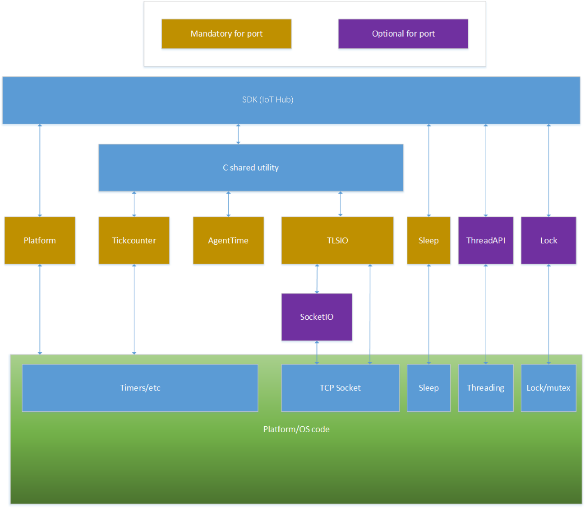
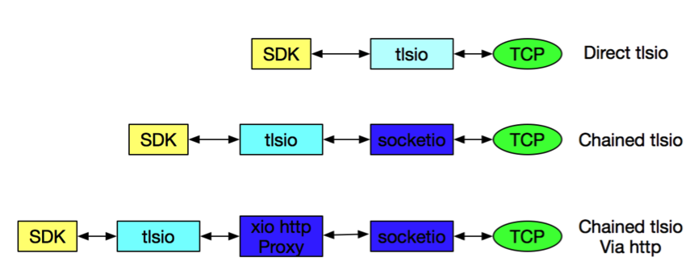

# 如何移植百度天工IotCore C语言SDK到其他平台

本文档主要介绍如何移植C公共库到其他目前还未支持的平台。
当前百度云天工的IoTCore的C语言SDK是使用该C公共库，下述内容详细描述如何移植该C公共库至其他平台。

本文档不会特定介绍哪一个具体的平台移植方案，是一个通用的移植方案。

## 参考

###### 规范
- [tickcounter 适配器规范](./c-utility/devdoc/tickcounter_freertos_requirement.md) 
- [agenttime 适配器规范](./c-utility/devdoc/agenttime_requirements.md) 
- [threadapi 及 sleep 适配器规范](./c-utility/devdoc/threadapi_and_sleep_requirements.md) 
- [platform 适配器规范](./c-utility/devdoc/platform_requirements.md) 
- [tlsio 说明](./c-utility/devdoc/tlsio_requirements.md) 
- [xio 说明](./c-utility/devdoc/xio_requirements.md) 
- [lock 适配器规范](./c-utility/devdoc/lock_requirements.md) 

###### 头文件
- [tickcounter.h](./c-utility/inc/azure_c_shared_utility/tickcounter.h) 
- [threadapi.h](./c-utility/inc/azure_c_shared_utility/threadapi.h) 
- [xio.h](./c-utility/inc/azure_c_shared_utility/xio.h) 
- [tlsio.h](./c-utility/inc/azure_c_shared_utility/tlsio.h) 
- [socketio.h](./c-utility/inc/azure_c_shared_utility/socketio.h) 
- [lock.h](./c-utility/inc/azure_c_shared_utility/lock.h) 
- [platform.h](./c-utility/inc/azure_c_shared_utility/platform.h) 

# 目录结构

- 整体概括
- tickcounter 适配器
- agenttime适配器
- sleep适配器
- platform 适配器
- tlsio adapter 适配器
- socketio 适配器概括(可选)
- tlsio适配器实现
- threadapi and lock适配器(可选)

## 概况

目前这个采用C99标准编写的C公共库可以很方便的移植到大部分平台，其中有几个组件依赖平台的特定资源来实现所需的功能。
因此，这个C公共库提供PAL（platform abstraction layer）模块来让这个库可以适配到特定平台。下面就是这个模块的整体架构:

必须适配的几个模块如下：

- tickcounter的实现：这个接口提供一个可以获取以毫秒为单位时钟计数器。精度不一定必须是毫秒级别，但是这个接口的返回值必须是以毫秒为单位。

- agenttime的实现： 这个接口提供c运行时的函数，包括获取time，difftime等等。这个主要由于不同平台对具体实现的处理方式不一样。

- sleep函数的实现提供一个平台无关的sleep逻辑。

- platform接口提供执行全局初始化和反初始化的逻辑。

- tlsio接口提供标准的基于TLS之上的通讯方式。

另外，有两个可选的模块，他们是threadapi和lock，这两个模块允许SDK通过特定的线程来进行数据通讯。
另外一个需要适配的模块是socketio适配器，这个需要配合tlsio不同实现方式。

目前该SDK已经包含了一个标准适配实现，你可以在SDK的特定目录下找到他们。
如果其中的一些适配器满足你的设备需求的话，可以直接引用这些文件到你的项目。

### tickcounter适配器

Tickcounter的行为定义在tickcounter适配器的规范中指定。
你可以通过复制一份tickcounter.c文件，并进行修改来适配你的设备，同时tickcounter规范包含了对内存大小的优化方案建议。

### agenttime适配器

agentime适配器的逻辑在agenttime适配器规范里面做了详细介绍以及如何提供一个与使用平台无关的time函数
大部分的平台和操作系统可以使用标准agentime.c文件，将此文件放到你的编译环境。这个适配器只是简单的调用c语言的的time, difftime, ctime 函数等等。
如果这个文件在你的平台无法工作的，你可以拷贝一份，做适当的修改。
百度IoT SDK只需要get_time和get_difftime这两个函数。get_gmtime, get_mktime和get_ctime已经被弃用了，可以直接忽略不管。

### sleep适配器

这个sleep适配器只是提供一个函数，提供一个平台无关的线程sleep函数。 不同于其他适配器，这个适配器没有自己的头文件。他是将这个函数定义在threadapi.h，这个头文件还包含其他的一些可选的适配函数，这个函数的实现通常定义在threadapi.c文件。

与threadapi.h中的其他函数不同的是，ThreadAPI_Sleep是SDK所必需的，并且必须始终有效。

sleep适配器的规范可以在threadapi 和 sleeep适配器规范里面找到

### platform适配器

platform适配器主要执行一次性平台的初始化和反初始化，同时也提供SDK的TLSIO相关的支持。

Platform适配器规范给出详细的介绍关于如何编译platform适配器
你可以通过拷贝一份platform.c文件，通过修改来适配自己的需求

### threadapi and lock适配器

编译SDK必须包含threadapi和lock这个两个适配器，但是功能实现是可选的。他们的规范文档详细介绍如果不需要线程（threading）相关的功能的话，其他空函数应该怎么做。

这个模块允许SDK通过指定的线程和IoT Hub交互。特定的线程执行特定任务有很多额外的开销，原因在于需要为每个线程分为独立的stack，这样对于某些资源受限的设备来说，就比较困难了。

试用特定线程执行tlsio相关逻辑的好处就是当网络不可用时，可以尝试重新连接IoT Hub，同时还有其他线程可以处理其他逻辑，这样程序的响应会比较及时。

以后版本的SDK会移除潜在的blocking的行为，不过现在任然需要指定线程来处理消息，提高系统的响应，这样就需要实现ThreadAPI和Lock适配器

下面是threadapi和lock适配器规范
- threadapi 和 sleep 适配器规范
- lock 适配器规范

这个规范介绍当不需要线程的时候，如何去创建null lock和threadapi的适配器。

如果需要创建自己的threadapi和lock适配器，可以拷贝windows的适配文件，通过适当修改来满足你的需求：
threadapi.c
lock.c

### tlsio适配器介绍

**tlsio**适配器提供SDK可以通过标准的安全的TLS通讯方式让设备和IoT Hub交互数据 

Tlsio适配器通过xio接口暴露功能让SDK来调用，这个接口提供一个输入为bits，返回也为bits的接口，具体定义可以访问：./c-utility/inc/azure_c_shared_utility/xio.h

通过调用函数xio_create来创建tlsio适配器实例，在创建tlsio实例的时候，你必须配置参数const void *io_create_parameteres，这个参数是TLSIO_CONFIG的一种类型。

##### tlsio有两种模式

tlsio支持的模式包括两种：直接的，串联的。在直接模式，tlsio适配器直接创建自己的TCP socket，试用TCP直接和远程的服务器进行TLS通讯。在串联模式下，tlsio适配器不拥有自己的TCP socket，不直接和远程服务器通讯，但是它任然处理TLS的所有逻辑，包括加密，解密，协商，只不过通过另外的方式和远程服务器进行通讯。

直接模式的好处是消耗资源会少很多，比较适合MCU，比如Arduino和ESP32等等。串联模式提供更大的灵活度，但是资源消耗也会多很多，所以主要主流的OS，比如windows，linux和Mac等等

### socketio适配器简介

串联的tlsio适配器必须调用xio的适配器，这个适配器可以包含一个tcp socket。在百度的IoT SDK里面，xio适配器是通过socketio管理tcp socket。

下面的这个图介绍tls的数据流模型：

### tlsio适配器实现

开发tlsio适配器功能相对来说还是很复杂的，需要很有经验的开发人员才能完成，需要对协议有很深的理解。
tlsio适配器相关的逻辑都是在C公共库实现的，不是百度IoT SDK的一部分。可以参考下面的资料去了解如何开发。
有两个直接模式tlsio适配器实现：
- tlsio_openssl_conpact for ESP32
https://github.com/Azure/azure-iot-pal-esp32/blob/master/pal/src/tlsio_openssl_compact.c
- tlsio_arduino for Arduino
https://github.com/Azure/azure-iot-pal-arduino/blob/master/pal/src/tlsio_arduino.c

tlsio_openssl_compact for ESP32是一个好的例子，如果需要适配的话，可以拷贝一份，基于这个修改来满足自己的需求。
tlsio_openssl_conpact for ESP32提供类两个文件，这两个文件是和具体平台无关的
- socket_async.c
./c-utility/pal/socket_async.c
- dns_async.c
./c-utility/pal/dns_async.c

大部分的用户都可以直接使用这两个文件而不需要修改，对于特殊情况只需要修改socket_async_os.h就可以了

支持设备支持仓库

推荐参考https://github.com/Azure/azure-iot-pal-esp32，来创建一个自己的仓库。
